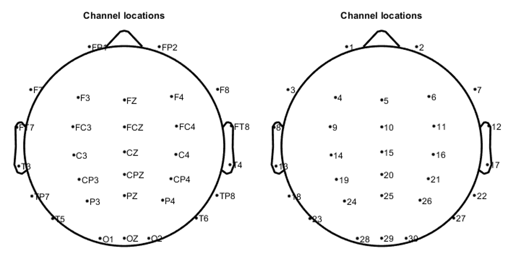

# Artifact Removal Transformer (ART)
This study introduces the Artifact Removal Transformer (ART), a novel EEG denoising model that employs transformer architecture to effectively handle multichannel EEG data. ART is specifically designed to capture the millisecond-scale transient dynamics inherent in EEG, providing a comprehensive, end-to-end solution for denoising various types of artifacts. This advancement builds on our previous enhancement of the IC-U-Net model, which now includes positional encoding and self-attention mechanisms to significantly improve signal reconstruction capabilities. To train these models, we refined the generation of noisy-clean EEG data pairs using an independent component analysis approach, creating robust training scenarios essential for supervised learning.

🤗 [Artifact Removal Transformer](https://huggingface.co/spaces/CNElab/ArtifactRemovalTransformer)


> **ART: An Artifact Removal Transformer for Reconstructing Noise-Free Multi-Channel EEG Signals** [[arXiv paper](#)]<br>
> Chun-Hsiang Chuang, Kong-Yi Chang, Chih-Sheng Huang, Anne-Mei Bessasa<br>
> [CNElab](https://sites.google.com/view/chchuang/)<br>

# Basic Usage (For Users Familiar with the Process)

## Installation
1. Clone the repository

```sh
git clone https://github.com/CNElab-Plus/ArtifactRemovalTransformer.git
```

2. Download **checkpoints**: you need to download the 'ART', 'ICUNet', 'ICUNet_attn', 'ICUNet++', respectivily. Then move these folder to under the `./model` folder.
[Google drive link](https://drive.google.com/drive/folders/1ahbqcyBs6pwfWHaIf_N978DZD-JmGQJg?usp=sharing)

3. Create a virtual environment and install the required packages (tested with Python 3.12.4 on Windows):

```sh
python -m venv ART
Set-ExecutionPolicy -Scope Process -ExecutionPolicy Bypass
ART\Scripts\Activate.ps1
pip install torch==2.2.0 torchvision==0.17.0 torchaudio==2.2.0 --index-url https://download.pytorch.org/whl/cpu
pip install scipy
```
> we don't need `requirements.txt`

## Inference
1. Check parameters in `main.py`
```sh
input_path = './sampledata/'
input_name = 'sampledata.csv'
sample_rate = 256 # input data sample rate
modelname = 'ART' # or 'ICUNet', 'ICUNet++', 'ICUNet_attn', 'ART'
output_path = './sampledata/'
output_name = 'outputsample.csv'
```
2. Run the code
```sh
python .\main.py
```

# Advanced Usage (Customized Data)

## Introduce our sample data
1. The data needs to be a two-dimensional array (channel, timepoint) with exactly **30 channels**.
2. Your EEG data must be convert in `.csv` format.
3. Output data must be **resampled** to **256 Hz**
4. We provide the sample channel location in `template_chanlocs.loc` format, which can be obtained using [EEGLAB](https://sccn.ucsd.edu/eeglab/download.php)

## Channel Mapping
When training, we use 30 channels, so we need to adjust data with fewer or more than 30 channels to exactly 30 channels.

1. You need to refer to the original channel location to create the corresponding array. The original channel location is as follows:


2. Refer to the original channel location to create the corresponding array. For example, using the [PhysioNet Motor Movement/Imagery Dataset](https://www.physionet.org/content/eegmmidb/1.0.0/), align the corresponding channels as needed. 


```
old_idx = [ 22,  24, 30, 32, 34, 36, 38,  39,   2,   4,   6,  40, 41,  9, 11, 13, 42,  45,  16,  18,  20,  46, 47, 49, 51, 53, 55, 61, 62, 63]
```
3. Modify parameters in `channel_mapping.py`
```python
input_path = './sampledata/'
output_path = './sampledata/'
input_name = 'sampledata.csv'
output_name = 'outputsample.csv'
```

4. Run the code
```sh
python .\channel_mapping.py
```

## Batch processing
1. For batch processing, wrap the executed code in a for loop.

2. Example for `channel_mapping.py`:
```python
for idx in range(num_data):
    # Wrap the name in a for loop
    input_name = 'raw_{:03d}.csv'.format(idx)
    output_name = 'mapped_{:03d}.csv'.format(idx)

    # read input data
    old_data = read_train_data(input_path+input_name)
    new_data = np.zeros((30, old_data.shape[1]))

	# ** key step ** Channel Mapping
    for j in range(30):
        new_data[j, :] = old_data[old_idx[j]-1, :]
    
	# save the data
    save_data(new_data, output_path+output_name)
```

3. Example for `main.py`:
```python
for idx in range(num_data):
    # Wrap the name in a for loop
    input_name  = 'mapped_{:03d}.csv'.format(idx)
    output_name = 'reconstruct_{:03d}.csv'.format(idx)

    # step1: Data preprocessing
    preprocess_data = utils.preprocessing(input_path+input_name, sample_rate)

    # step2: Signal reconstruction
    utils.reconstruct(modelname, preprocess_data, output_path+output_name)
```

# Citation
[1] C.-H. Chuang, K.-Y. Chang, C.-S. Huang, and T.-P. Jung, "[IC-U-Net: A U-Net-based denoising autoencoder using mixtures of independent components for automatic EEG artifact removal](https://www.sciencedirect.com/science/article/pii/S1053811922007017)," NeuroImage, vol. 263, p. 119586, 2022/11/01/ 2022 <br>
[2]  K. Y. Chang, Y. C. Huang, and C. H. Chuang, "[Enhancing EEG Artifact Removal Efficiency by Introducing Dense Skip Connections to IC-U-Net](https://ieeexplore.ieee.org/document/10340520)," in 2023 45th Annual International Conference of the IEEE Engineering in Medicine & Biology Society (EMBC), 24-27 July 2023 2023, pp. 1-4